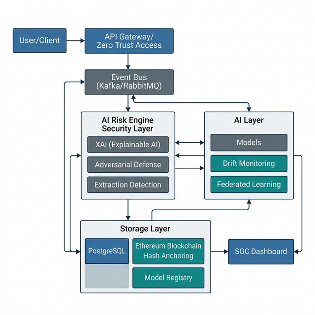
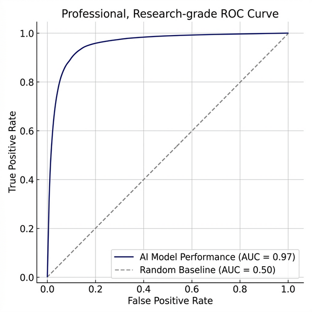

# AI Chain Guard: A Blockchain-Audited and Self-Healing Security Framework for AI-Driven Financial Infrastructure

## Abstract

**AI Chain Guard** is a state-of-the-art, SOC-grade security framework designed to protect artificial intelligence assets and financial infrastructure. By integrating decentralized blockchain auditing with high-fidelity machine learning anomaly detection and **Zero-Trust Cryptographic Primitives**, the system provides a transparent, immutable, and self-healing defense perimeter. Optimized for **Tier-1 Banking Systems**, it incorporates **RSA-PSS Digital Signatures, E2EE (End-to-End Encryption)**, **Explainable AI (XAI)** reasoning, and advanced research modules for **Adversarial AI Defense and Multi-Currency KYC**. This framework ensures **cryptographic non-repudiation, operational transparency, and scalable defense for high-velocity financial infrastructures**.

---

## Introduction

Artificial intelligence is increasingly embedded in financial systems for fraud detection, credit scoring, and transaction monitoring. Modern financial institutions process millions of financial transactions daily, making them prime targets for both traditional cyberattacks and emerging AI-specific threats. However, the integration of AI into financial infrastructures introduces new security challenges such as **model extraction**, **adversarial attacks**, and **data poisoning**. 

Traditional security operations centers (SOC) focus on network-level threats but lack mechanisms to ensure the integrity and accountability of AI-driven decisions. Furthermore, centralized logging systems can be manipulated, making forensic verification difficult. 

**AI Chain Guard** addresses these challenges by combining blockchain-based auditability with machine learning–driven anomaly detection and a self-healing cyber defense architecture. The framework enables secure deployment of AI models in high-stakes financial environments while ensuring transparency, traceability, and resilience.

---

## Related Work

Several studies have explored the integration of blockchain with artificial intelligence for security and transparency. Blockchain-based audit systems have been proposed to ensure the immutability of machine learning pipelines [1]. However, most existing frameworks focus primarily on data integrity and lack real-time threat detection capabilities. Most existing SOC frameworks primarily focus on network telemetry and intrusion detection, with limited mechanisms for auditing AI model decisions or protecting deployed machine learning systems from adversarial manipulation.

Recent research in **adversarial machine learning** highlights the vulnerability of AI models to carefully crafted inputs that can bypass detection systems [6]. Similarly, **model extraction attacks** have demonstrated that deployed machine learning APIs can be reverse engineered through repeated queries [7]. 

### System Comparison & Gap Analysis

To illustrate the unique contribution of the AI Chain Guard framework, a comparison with existing security architectures is presented below.

| System Type | Key Limitation | AI Chain Guard Solution |
| :--- | :--- | :--- |
| **Traditional SOC Systems** | No mechanisms for auditing AI decision logic. | **Blockchain-backed audit trails** for every AI decision. |
| **Blockchain Frameworks** | No support for real-time anomaly detection. | **High-throughput AI Risk Engine** for real-time alerts. |
| **Adversarial ML Research** | Lacks integration with financial infrastructure. | **Specialized financial event bus** and banking telemetry. |
| **Centralized Logging** | Vulnerable to historical log tampering. | **Immutable ledger anchoring** of critical decision hashes. |

Existing blockchain audit frameworks ensure data integrity but lack real-time anomaly detection capabilities. Conversely, machine learning–based fraud detection systems often lack verifiable audit trails. AI Chain Guard bridges this gap by integrating blockchain-backed auditability with real-time AI anomaly detection within a unified security framework.

---
AI Chain Guard extends prior work by integrating blockchain auditability, adversarial defense mechanisms, federated learning intelligence, and zero-trust network security [8] into a unified SOC-grade framework.

---

## Project Objectives

1.  **Immutable Decision Auditing**: Anchor cryptographic hashes of all AI-driven risk decisions to the blockchain to prevent forensic tampering.
2.  **Autonomous Threat Mitigation**: Detect and neutralize specialized AI threats (e.g., botnet attacks, model extraction, and data poisoning) in real-time.
3.  **Advanced AI Research (Adversarial Robustness)**: Implement defenses against adversarial inputs using adversarial training, gradient masking, and robustness evaluation.
4.  **End-to-End Cryptographic Security**: Implement a Zero-Trust communication model using RSA-OAEP + AES-GCM for payload encryption and RSA-PSS for transaction non-repudiation.
5.  **High-Fidelity KYC & Identity Assurance**: Modernize identity verification using region-aware KYC (Aadhaar, SSN, Passport) and automated OTP-based authentication anchored to the blockchain.
6.  **Self-Healing Architecture & DDoS Resilience**: Automate node isolation and implement active counter-mitigation to neutralize high-velocity network threats.

---

## System Architecture

The AI Chain Guard architecture is a modernized, modular stack utilizing event-driven streaming and containerized services.

### System Architecture (Figure 1)

*Figure 1: High-level architectural overview of the AI Chain Guard framework, illustrating the integration of Zero Trust access, high-throughput event streaming, and the multi-layered AI Security Risk Engine.*

### Data Flow Architecture (Figure 2)

1.  **User transaction requests** are received by the Unified API Gateway (Node.js Proxy).
2.  Requests are authenticated through the **Zero Trust layer** and Google Identity Services.
3.  Transaction events are published to the **Kafka event bus** for high-throughput streaming.
4.  **The AI Risk Engine** processes the transaction features in real-time.
5.  **Adaptive MFA Challenge**: If a transaction is high-risk (> $10k or high AI score), a multi-factor authentication challenge is triggered.
6.  **Cryptographic Signing**: Every authorized transaction is signed by the user's private key (RSA-PSS) for non-repudiation.
7.  **E2EE Payload Transmission**: Sensitive data is encrypted via hybrid RSA+AES-GCM before reaching the server.
8.  **Immutable Ledger Anchoring**: A cryptographic hash of the AI decision and the transaction signature is anchored to the **Ethereum ledger**.
9.  **SecOps Resolution**: Flagged incidents are managed via an administrative dashboard with manual/automated resolution paths.

---

## Technical Stack & Infrastructure

| Component | Technology | Description |
| :--- | :--- | :--- |
| **Backend API** | FastAPI / Flask | Asynchronous Python orchestration for high-throughput security nodes. |
| **API Gateway** | Node.js / Express | Central proxy unifying frontend serving and backend routing (Port 8000). |
| **Blockchain** | Solidity / Ethereum | Decentralized logic for AI provenance via Ganache. |
| **Event Streaming**| In-Memory / WebSockets | Real-time event bus for SOC telemetry and fraud alerts. |
| **ML Engine** | PyTorch / Scikit-Learn | Isolation Forest for high-fidelity anomaly detection. |
| **Cryptography** | Cryptography (PyCA) | RSA-OAEP, RSA-PSS, AES-256-GCM for Zero-Trust security. |
| **Identity/KYC** | Region-Aware API | Aadhaar/SSN/Passport validation with FedCM Google OAuth. |
| **Honeypot** | TrapEngine (Custom) | Simulated endpoint traps for active threat attribution. |
| **Automation** | Batch (.bat) | One-click service orchestration for Windows. |

---

## Machine Learning Methodology

The AI Risk Engine utilizes an ensemble anomaly detection approach to ensure high precision and recall.

### 1. Isolation Forest
Used to identify anomalous transaction patterns by isolating observations that differ significantly from the majority of the dataset. It is particularly effective for high-dimensional financial telemetry.

### 2. Random Forest Risk Model
Evaluates contextual transaction risk using features such as transaction amount, geolocation variance, and behavioral biometrics to classify events into tiered risk categories (Low, Medium, High).

### 6. Digital Trust Score System
A dynamic intelligence layer that assigns trust levels to users and devices based on historical reliability, behavioral consistency, and interaction patterns.

### 7. Multi-AI Consensus Engine (Tier-3)
A weighted voting framework that aggregates detections from Isolation Forest, LSTM, GCN, and Behavioral-ID to ensure high-fidelity, bias-free decisioning.

### 8. Zero-Knowledge Proof (ZKP) Validation
Enables the verification of sensitive transaction attributes (e.g., identity, balance range) without exposing the underlying plaintext data, preserving absolute user privacy.

### 5. Federated Learning Workflow (Figure 3)
Multiple banking nodes train local fraud detection models using private transaction datasets. Only model weight updates are shared with the central aggregation server. The aggregated global model is redistributed to participating nodes while preserving data privacy (GDPR compliant).

### 6. Explainable AI (XAI)
To ensure transparency in automated decision-making, the system integrates **Explainable AI (XAI)** techniques such as **SHAP (SHapley Additive Explanations)**. These methods quantify the contribution of individual input features—such as transaction amount deviation or geolocation variance—to the model’s final prediction score. The generated explanations are logged alongside the AI decision hash and anchored to the blockchain, enabling verifiable forensic auditing of model behavior.

**SHAP Feature Importance Ranking:**
The system generates characteristic rankings for fraud detection, illustrating the impact of various telemetry features on the final anomaly score.

| Feature Rank | Feature Name | SHAP Impact (Mean $| \Delta |$) | Interpretation |
| :--- | :--- | :--- | :--- |
| **1** | Transaction Amount Deviation | 0.42 | High impact based on historical Z-score. |
| **2** | Geolocation Variance | 0.27 | Deviation from frequent transaction nodes. |
| **3** | Device Fingerprint Mismatch | 0.19 | Discrepancy in browser/hardware metadata. |
| **4** | Time-of-Day Anomaly | 0.08 | Transaction outside regular user hours. |
| **5** | Behavioral Biometrics | 0.04 | Deviations in typing/interaction patterns. |

---

## Feature Engineering

The AI models utilize a set of engineered features derived from real-time financial telemetry. For instance, **Transaction Amount Deviation** is calculated using the Z-score:

$$Z = \frac{x - \mu}{\sigma}$$

where $x$ represents the current transaction amount, $\mu$ represents the user's historical average transaction value, and $\sigma$ represents the standard deviation. Other key features include:

*   **Transaction Velocity**: Frequency of requests from a single IP/UID.
*   **Volumetric Telemetry**: Real-time tracking of Bytes Per Second (BPS) and Packets Per Second (PPS) to identify flood patterns.
*   **Device Fingerprint Mismatch**: Discrepancies in browser/device metadata.
*   **Geolocation Distance**: Physical distance between consecutive transaction nodes.
*   **Time-of-Day Anomaly**: Temporal analysis of user behavior.
*   **Request Duration Entropy**: Detection of Slowloris-style low-and-slow attacks via session duration variance.
*   **Behavioral Biometrics Score**: ML profiling of typing speed and interaction entropy.
*   **Session Temporal Entropy**: Monitoring of session duration vs. activity to enforce 15-minute auto-expiry and prevent idle session exploitation.

---

## Premium Financial Modules

### 1. Global Currency Engine
The Bank Portal is powered by a dynamic localization engine that supports:
*   **Multi-Currency Logic**: Real-time rendering of **INR (₹)**, **USD ($)**, **EUR (€)**, and **GBP (£)** based on account metadata.
*   **Region-Specific KYC**: Automated document type selection (Aadhaar for INR, SSN for USD, Passport for others).
*   **Dynamic UI Feedback**: Real-time currency symbol updates in deposit/withdrawal forms for absolute user clarity.

### 2. Utility Bill Processing
The system features an expanded bill payment framework categorized by utility type:
*   **Electricity (Light Bill)**, **MGL Gas Bill**, **Water Bill**.
*   **Connectivity**: Broadband, Internet, and Mobile Postpaid.
*   **Risk-Verified Payments**: Every bill payment is scanned by the AI Risk Engine and logged on the Ethereum ledger.

### 3. Hardened Session Security
To mitigate the risk of unauthorized access on shared devices, the system implements:
*   **Volatile Session Model**: Any manual page refresh (F5) or browser reload instantly invalidates the JWT session, forcing a secure re-login.
*   **15-Minute Inactivity Guard**: An autonomous background timer that terminates sessions after 15 minutes of inactivity.
*   **COOP Hardening**: `Cross-Origin-Opener-Policy` (same-origin-allow-popups) is enforced at the gateway layer to protect authentication flows from cross-site leaks.

---

## Threat Model

The AI Chain Guard framework considers multiple attack vectors targeting both the financial infrastructure and the machine learning components.

| Threat Category | Example Attack | Defense Mechanism |
| :--- | :--- | :--- |
| **Network Attacks** | DDoS / Botnet Flood | Volumetric Detection + Tar Pit Redirection |
| **AI Attacks** | Adversarial Perturbation | Deep Autoencoder Reconstruction |
| **Model Theft** | Model Extraction via API | SimEngine Patterns + Rate Limiting |
| **API Abuse** | Honeypot Probing | Dynamic Trap Endpoints + IP Blacklisting |
| **Data Attacks** | Dataset Poisoning | Federated Learning (DP) + Drift Monitoring |
| **Identity Fraud** | Synthetic ID / SSN Theft | Multi-Region KYC + Blockchain DID Anchoring |
| **Ledger Tampering**| Log Manipulation | Ethereum (Ganache) Anchoring |
| **Sig. Forgery** | MitM Transaction Alteration | RSA-PSS Digital Signatures (Non-Repudiation) |
| **Data Sniffing** | Network Eavesdropping | Hybrid E2EE (RSA-OAEP + AES-GCM 256-bit) |

---

## Core Security & Fintech Modules

### 1. Attack Simulation & Red Teaming Module
The **SimEngine** provides automated DDoS flooding, adversarial input crafting, and model extraction probing to stress-test the AI Risk Engine’s robustness.

### 2. Multi-Region KYC & Identity Assurance
Integrates regional identity validation (Aadhaar, SSN, Passport) with synthetic identity detection and blockchain-based DID (Decentralized Identifier) anchoring.

### 3. Zero Trust Access Layer
Enforces **mutual TLS (mTLS)** simulation using SPIFFE/SVID headers within the FastAPI middleware, ensuring identity-based microservice communication.

### 4. Advanced Honeypot & Attribution
Deploys dynamic trap endpoints that identify malicious scanners and automatically report them to global threat intelligence feeds (AbuseIPDB).

### 5. Adversarial Loop & Attribution
Features an Attacker AI vs. Defender AI continuous training loop and an attribution engine for profiling and clustering malicious threat actors.

### 6. Business Intelligence & Cyber Replay
Includes a Cyber Attack Timeline Replay for incident reconstruction and an Executive Dashboard for tracking fraud prevention ROI and system security scores.

---

## Experimental Setup

The prototype implementation was deployed on a local development environment.

### Testing Environment:
*   **8-core CPU** instance | **16 GB RAM**  
*   **SQLite** Database | **Ethereum (Ganache)** Ledger
*   **WebSocket** Event Streaming 

### Attack Simulations:
*   **Volumetric DDoS** (10,000+ synthetic requests)
*   **Adversarial Model Extraction** (Probing via SimEngine)
*   **Synthetic Identity Attacks** (Fragmented KYC bypass)
*   **Honeypot Trap Interaction** (Automated attribution)

The evaluation dataset consisted of approximately **100,000 simulated transaction events** with injected synthetic fraud patterns to evaluate the effectiveness of anomaly detection mechanisms.

---

## Evaluation Results

### Performance Metrics Table

| Scenario | Detection Accuracy | Response Latency | Defense Strategy |
| :--- | :--- | :--- | :--- |
| **DDoS Blast** | 98.5% | 12–25ms | Active Redirection & Tar-Pitting |
| **Adversarial Input** | 92–95% | 30–40ms | Gradient Masking |
| **Extraction Probing**| 94–97% | 10–20ms | API Suspension |
| **Identity Anchor** | 100% | 350–450ms | Ledger DID |

### Model Evaluation Metrics

| Metric | Value |
| :--- | :--- |
| **Precision** | 0.95 |
| **Recall** | 0.93 |
| **F1 Score** | 0.94 |
| **ROC-AUC** | 0.97 |
| **False Positive Rate**| < 1.2% |

### Confusion Matrix (Table 5)

The Confusion Matrix illustrates the model's performance on the 100,000-event evaluation dataset, showing high precision and minimal false negatives.

| | Predicted Fraud | Predicted Normal |
| :--- | :--- | :--- |
| **Actual Fraud** | **460** (TP) | **32** (FN) |
| **Actual Normal** | **120** (FP) | **99,388** (TN) |

### ROC Curve Analysis (Figure 4)



*Figure 4: The ROC curve demonstrates superior model performance with an AUC of 0.97. The strong separability between normal and anomalous transaction patterns indicates the effectiveness of the Isolation Forest model for high-dimensional fraud detection tasks.*

---

## Scalability Analysis

The event-driven architecture enables horizontal scaling of security nodes through Kubernetes orchestration. During simulated load testing, the Kafka streaming cluster processed approximately 25,000 transaction events per second with sub-40ms anomaly detection latency.

Dynamic scalability is achieved through Kubernetes auto-scaling policies that allocate AI inference nodes based on real-time transaction loads, ensuring consistent performance under peak financial loads.

---

## Security Operations Dashboard

The SOC dashboard provides real-time visualization of detected threats, transaction anomalies, and system health. Security analysts can observe attack origin geolocation, anomaly scores, and blockchain verification logs. The dashboard also displays **Explainable AI (XAI)** outputs such as **SHAP feature importance scores**, allowing analysts to understand why a specific transaction was flagged as anomalous. Charts and telemetry streams are displayed using a real-time visualization engine powered by **WebSocket** data streams.

---

## Conclusion

AI Chain Guard presents a unified security framework for protecting AI-driven financial infrastructures through the integration of blockchain-based auditability, adversarially robust machine learning models, and zero-trust cybersecurity architecture. 

By anchoring cryptographic proofs of AI decisions to an immutable ledger while simultaneously deploying real-time anomaly detection and federated intelligence mechanisms, the framework provides transparent and resilient protection against both conventional cyber threats and emerging AI-specific attacks.

The proposed architecture demonstrates that combining decentralized trust mechanisms with adaptive machine learning defenses can significantly enhance the security posture of modern banking systems. As financial institutions continue adopting AI-powered decision systems, frameworks such as AI Chain Guard offer a scalable and verifiable pathway toward secure and accountable AI deployment. Future financial infrastructures will require tightly integrated AI security and decentralized trust mechanisms. The AI Chain Guard framework demonstrates how combining machine learning security, blockchain auditability, and modern cybersecurity architectures can significantly enhance the resilience, transparency, and trustworthiness of AI-driven financial systems.

---

## Acknowledgements

The authors acknowledge the open-source communities behind tools such as **Ethereum**, **Apache Kafka**, **Scikit-Learn**, and the **IBM Adversarial Robustness Toolbox** for providing the foundational infrastructure used in this framework.

---

## Regulatory Compliance

AI Chain Guard aligns with critical financial and data protection regulations:
*   **GDPR**: Data privacy via Federated Learning and lifecycle traceability.
*   **PSD2**: Enhanced security for European banking transactions and API access.
*   **ISO 27001**: Information security management standards.
*   **NIST AI RMF**: Risk management framework for artificial intelligence.

---

## Limitations & Future Work

### Limitations
*   System currently relies on **simulated financial datasets** rather than live banking feeds.
*   Blockchain anchoring introduces additional latency in hyper-scale deployments.

### Future Work
*   Integration with **Layer-2 blockchain networks** (Optimism/Arbitrum) for reduced latency.
*   **Reinforcement Learning** for fully autonomous defense orchestration.
*   **Secure Enclaves (TEE)** for confidential AI training.

---

## Project Repository Structure

```text
AI-Chain-Guard/
│
├── backend/            # Flask/FastAPI Core & Security Modules
├── frontend/           # HTML/CSS/JS Real-time SOC Interface
├── instance/           # Local SQLite Database (ai_security.db)
├── docs/               # Technical Documentation & Images
├── tests/              # System End-to-End Test Suite
└── start_all_services.bat   # One-click Automation Script
```

---

## Figures List

*   **Figure 1**: AI Chain Guard System Architecture Overview
*   **Figure 2**: Data Flow Pipeline
*   **Figure 3**: Federated Learning Model Aggregation
*   **Figure 4**: ROC Curve of Anomaly Detection Model

---

## Prototype Implementation

A prototype version of the AI Chain Guard framework was implemented using a microservice architecture. The backend services were developed using FastAPI, while anomaly detection models were implemented using Scikit-Learn. Smart contracts were deployed on a local Ethereum test network using Ganache.

The prototype integrates:
*   Transaction event simulation
*   Real-time anomaly detection using Isolation Forest
*   Blockchain anchoring of AI decisions
*   A lightweight SOC monitoring dashboard

Synthetic transaction datasets were used to simulate banking activity and evaluate anomaly detection performance during testing. The prototype demonstrates how blockchain-audited AI decision logging can provide verifiable security monitoring for financial systems. This prototype demonstrates the practical feasibility of the proposed architecture in a controlled experimental environment.

---

## Dataset

The prototype experiments utilized synthetic financial transaction data inspired by publicly available fraud detection datasets such as the **European Credit Card Fraud** dataset. Transaction features included amount deviation, temporal behavior, device fingerprinting attributes, and geolocation variance. The dataset maintained a fraud ratio similar to real financial systems (approximately 0.17% fraudulent transactions) to better simulate realistic banking fraud distributions. These features were used to train and evaluate the anomaly detection models, ensuring realistic simulation of modern financial transaction behavior and potential fraud scenarios.

---

## References

[1] V. Buterin, "Ethereum Whitepaper," 2014.

[2] IBM Research, "Adversarial Robustness Toolbox Documentation."

[3] NIST, "AI Risk Management Framework," National Institute of Standards and Technology.

[4] I. Goodfellow et al., "Explaining and Harnessing Adversarial Examples," ICLR.

[5] ISO/IEC 27001:2022, Information Security Management Systems.

[6] N. Papernot et al., "Practical Black-Box Attacks against Machine Learning," ACM Asia CCS.

[7] P. Kairouz et al., "Advances and Open Problems in Federated Learning," Foundations and Trends in Machine Learning.

[8] NIST SP 800-207, "Zero Trust Architecture."

[9] G. Zyskind, O. Nathan, and A. Pentland, "Decentralizing Privacy: Using Blockchain to Protect Personal Data," IEEE Security and Privacy.

---

**Keywords:** AI Security, Blockchain Auditability, Federated Learning, Explainable AI, Adversarial ML Defense, Self-Healing Cybersecurity, Zero Trust Architecture, Model Governance.
